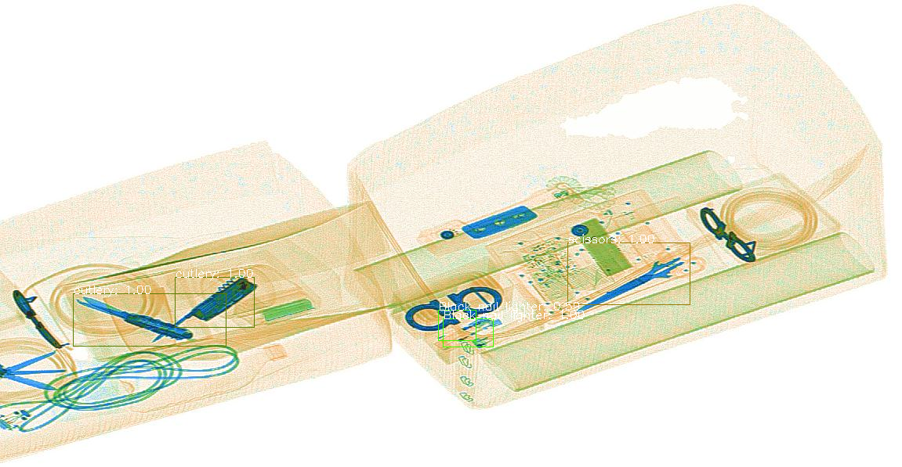

# Faster R-CNN and Mask R-CNN in PyTorch 1.0 for jingnan2

津南挑战赛2 基于faster R-Cnn 的x光机危险物品检测
参赛时间比较匆忙，因为准备找实习，使用一块2080(缺卡真难受),前前后后一共搞了大约3-4天的样子，代码基于facebook开源的基于pytorch的maskrcnn.使用resNet50fpn作为backbone。参数没怎么调，训练了两天左右，目前模型还没有收敛到最优，初赛排名138/2130名，我在本地基于coco评测我自己划分的验证集的map的几个指标都非常高map0.5:0.9大约在0.8左右，但是和线上差距过大，线上不到0.4，目前还不清楚是什么原因，等待后续天池放出test_a的数据的标签再测试看看。除此之外还基于keras（刚开始队友使用keras实现的yolov3,所以我基于keras写了个二分类模型）实现的inceptionV3训练了一个二分类模型，主要用来分restircted和normal类别。二分类模型的效果非常好，在验证集上的分类准确率接近1，可能也是官方更换评价指标的原因。结合两个模型，可以把检测的结果提升几个点。



## jingnan2  demo

在demo文件夹中集成了jinnan_test.py代码和jinnan_view.py代码分别用来出提交的结果和可视化。
```
cd demo
# 出提交结果
python jinnan_test.py
# 可视化结果
python jinnan2_view.py
```

## 环境安装

可以查看开源代码给出的安装教程
Check [INSTALL.md](INSTALL.md) for installation instructions.

## 数据处理
基于本代码我自己写jinnan2的数据接口并且根据我电脑的配置(一块2080)重新设置了一些超参数。由于数据的格式和coco格式有些略微差别，需要自己做一些预处理，标注文件的预处理代码为data_preprocessing.ipynb使用notebook打开，根据注释修改以一下标注文件的路径即可。
数据的存放格式为：
```
datasets--
    |--jinnan
        |--annotations
        |--images
        |--normal
        |--restricted
        |--test
        |--testb
```
上述文件中annotations存放预处理后的标注文件，主要为划分后的训练集标注和验证集标注。images中存放normal、和restricted文件夹中的所有图片，test、testb存放a榜和b榜训练数据。为了避免copy文件的麻烦，在ubuntu系统下可以使用ln同步命令。

```bash
# symlink the coco dataset
cd ~/github/maskrcnn-benchmark
mkdir -p datasets/jinnan
ln -s /path_to_jinnan_dataset/annotations   datasets/jinnan/annotations
ln -s /path_to_jinnan_dataset/images        datasets/jinnan/images
ln -s /path_to_jinnan_dataset/normal        datasets/jinnan/normal
ln -s /path_to_jinnan_dataset/restricted    datasets/jinnan/restricted
ln -s /path_to_jinnan_dataset/test          datasets/jinnan/test
ln -s /path_to_jinnan_dataset/testb         datasets/jinnan/testb
```
      
### 训练

如果环境和路径设置的没有错误在根目录下直接运行:
```
sh train.sh
```
测试模型：
```
sh test.sh
```
测试代码调用coco评测代码。


## Citations
Please consider citing this project in your publications if it helps your research. The following is a BibTeX reference. The BibTeX entry requires the `url` LaTeX package.
```
@misc{massa2018mrcnn,
author = {Massa, Francisco and Girshick, Ross},
title = {{maskrcnn-benchmark: Fast, modular reference implementation of Instance Segmentation and Object Detection algorithms in PyTorch}},
year = {2018},
howpublished = {\url{https://github.com/facebookresearch/maskrcnn-benchmark}},
note = {Accessed: [Insert date here]}
}
```

## Projects using maskrcnn-benchmark

- [RetinaMask: Learning to predict masks improves state-of-the-art single-shot detection for free](https://arxiv.org/abs/1901.03353). 
  Cheng-Yang Fu, Mykhailo Shvets, and Alexander C. Berg.
  Tech report, arXiv,1901.03353.


## License

maskrcnn-benchmark is released under the MIT license. See [LICENSE](LICENSE) for additional details.
